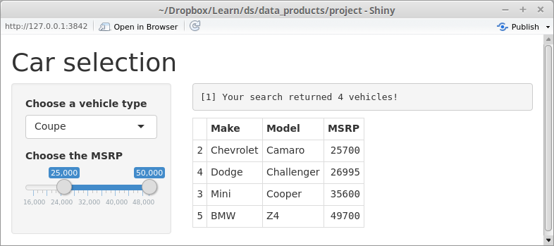

## An application for automobile selection

- The whole idea of this automobile selection tool comes from a real world scenario where people go to some internet website and search for their next vehicle. Often times, the type of vehicles such as Sedan, SUV or Minivan is the first criterion that comes to their mind. Most people also have a preset budget that partially determines the vehicle they eventually buy.
- In this exercise, the author implemented those two most commonly leveraged criteria in a R Shiny application. 
- The dataset was put together manually for a lack of existing dataset readily available on the internet.


## A quick peek of the actual dataset

```{r, echo=FALSE}
auto = read.csv("auto_selection.csv")
```

```{r}
summary(auto)
head(auto,3)
```


## The server side

- The output includes two components
    - the total number of vehicles that met the searching condition; and
    - a print out of the actual vehicles




## The UI

- The UI side script is pretty standard with
    - a select box; and
    - a two sided slider
- Couple things worth mentioning include
    - the choices in the select box are dynamically loaded from the dataset
    - the min and max MSRP on the slider are also dynamically determined with a floor and ceiling function to convert the price into thousands
    - the author also made "All" as a choice for select box for users who haven't made up mind on the type of vehicle to purchase.
